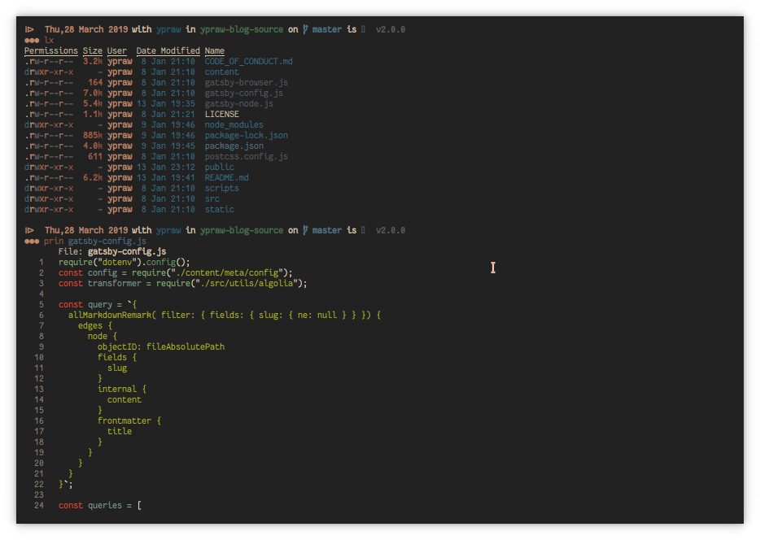

Halo guys XD, setelah membahas bagaimana trik untuk _Berhemat Battery_ pada Tutorial [Linux First Install](/Linux-First-Install), dalam kesempatan kali ini saya akan membahas mengenai langkah-langkah untuk mempercantik terminal Linux.

Didalam dunia unix-like, baik linux, macOs, ataupun os lain seperti bsd dan turunannya, sangat dikenal sekali fungsionalitas dari terminalnya atau _command line_. Selain flexibillitasnya, terminal atau command line juga sangat ampuh dalam memecahkan beberapa masalah seperti tidak bisanya login menggunakan gui, atau bahkan instalasi os seperti arch linux yang menggunakan terminal. Nah tentu karena seringnya beraktivitas menggunakan terminal, terkadang kita merasa bosan dengan tampilan yang itu-itu saja. Nah dalam kesempatan kali ini, saya akan menuliskan beberapa langkah untuk mengkustomisasi terminal.

Pada umumnya, terminal di linux berbasiskan [bash](https://www.gnu.org/software/bash/). Hanya saja untuk melakukan kustomisasi pada bash bagi saya sangat tidak menyenangkan (baca:sulit). Jadi saya memilih alternatif lain yaitu menggunakan zsh dan beberapa plugin untuk mengkustomisasi zsh. Walaupun sebenernya ada alternatif lain seperti fish dengan [oh-my-fish](https://github.com/oh-my-fish/oh-my-fish) nya dsb.

# Langkah-langkah

## Install zsh

Sebelum memulai tentu kita harus menginstall zsh dan menjadikannya default shell kita. Bagi pengguna arch linux maupun manjaro seperti saya, zsh sudah terinstall secara default, atau anda dapat mengecek apakah zsh sudah terinstall atau belum dengan memanggil zsh pada terminal.

```bash
zsh
```

jika ditemukan command not found, berarti anda belum memiliki zsh, dan dapat menginstallnya sesuai dengan distribusi yang anda gunakan, misalnya ubuntu dan turunannya dapat menggunakan perintah berikut atau sesuaikan dengan distribusi yang anda gunakan,

### ubuntu

```bash
sudo apt install zsh
```

### arch

```bash
sudo pacman -S zsh
```

### fedora

```bash
sudo dnf install zsh
```

setelah menginstallnya, langkah selanjutnya yaitu membuat zsh menjadi default shell anda dengan cara,

```bash
chsh -s $(which zsh)
```

kemudian logout dari sesi anda saat ini atau anda dapat juga merestart sistem operasi anda. Pastikan juga bahwa langkah ini berjalan dengan benar, setelah anda me-logout atau mereboot sistem operasi anda, ketikkan perintah berikut ini untuk memastikan bahwa langkah yang anda lakukan sudah sesuai.

```bash
echo $SHELL
```

hasil yang diharapkan adalah `/usr/bin/zsh` saat perintah tersebut dieksekusi.

Jika langkah-langkah diatas telah berhasil di lakukan maka selanjutnya adalah menyalin semua perintah yang ada pada file `.zshrc` saya (dalam hal ini saya lampirkan dibawah) kedalam file `.zshrc` anda yang berada pada lokasi `$HOME` anda.

# Cara cepat (zplug sebagai solusi pada file `.zshrc`)

Banyak tutorial yang bertebaran di google menyarankan setelah mengganti bash dengan zsh, langkah selanjutnya yaitu menginstall [oh-my-zsh](https://github.com/robbyrussell/oh-my-zsh) untuk menerapkan tema dan lain sebagainya. Akan tetapi, saya menemukan cara yang lebih mudah bahkan lebih simpel, yaitu menggunakan [zplug](https://github.com/zplug/zplug). Hanya menuliskan beberapa script pada file .zshrc maka otomatis zplug akan menginstall semua dependecy dan paket-paket yang telah di definisikan. Sebelum menyalin config yang saya gunakan, pastikan bahwa anda telah menginstall git.

Sebelum mengikuti script dibawah ini, pastikan juga bahwa anda telah menginstall [powerline fonts](https://github.com/powerline/fonts) atau [nerd fonts](https://github.com/ryanoasis/nerd-fonts). Disini saya menggunakan Fantasque nerd font sebagai font pada terminal saya. Untuk mempermudah anda, anda dapat mendownloadnya dari repository saya [disini](https://github.com/ypraw/configDotfiles/tree/master/fonts)

Sebagai contoh, berikut ini merupakan tampilan terminal saya,



untuk confignya dapat ditulis seperti dibawah ini,

```bash
# zplug init
export ZPLUG_HOME=$HOME/.zplug

[[ ! -f $ZPLUG_HOME/init.zsh ]] && git clone https://github.com/zplug/zplug $ZPLUG_HOME
source $ZPLUG_HOME/init.zsh

# do self-manage
zplug 'zplug/zplug', hook-build:'zplug --self-manage'

# auto-close quotes and brackets
zplug 'hlissner/zsh-autopair', defer:2, as:plugin
zplug "lib/history",      from:oh-my-zsh
zplug "lib/key-bindings", from:oh-my-zsh
zplug "lib/termsupport", from:oh-my-zsh
zplug "lib/completion", from:oh-my-zsh
zplug "lib/theme-and-appearance", from:oh-my-zsh


zplug 'zdharma/fast-syntax-highlighting', defer:2, hook-load:'FAST_HIGHLIGHT=()', as:plugin

zplug "zsh-users/zsh-autosuggestions", defer:2, as:plugin

zplug "zpm-zsh/ls", defer:2, as:plugin
zplug "zpm-zsh/dircolors-material", as:plugin
zplug "denysdovhan/spaceship-prompt", use:spaceship.zsh, as:theme

# finally install and load those plugins
# Install plugins if there are plugins that have not been installed
if ! zplug check; then
    printf "Install? [y/N]: "
    if read -q; then
        echo; zplug install
    fi
fi
zplug load

# returning command and folder completion when line is empty
# like a bash, but better
blanktab() { [[ $#BUFFER == 0 ]] && CURSOR=3 zle list-choices || zle expand-or-complete }
zle -N blanktab && bindkey '^I' blanktab


# load my own aliases
[[ -f $HOME/.aliases ]] && source $HOME/.aliases

#############################
# Customized Spaceship Theme#
#############################
ZSH_THEME="spaceship"
SPACESHIP_PROMPT_ORDER=(
  time
  user
  host
  dir
  git
  hg
  package
  ruby
  php
  docker
  venv
  conda
  pyenv
  line_sep
  vi_mode
  jobs
  exit_code
  char
)

#PROMPT
SPACESHIP_CHAR_SYMBOL='%F{$COLOR 3}\u25cf%F{$COLOR 3}\u25cf%F{$COLOR 3}\u25cf '
SPACESHIP_PROMPT_ADD_NEWLINE=true
SPACESHIP_PROMPT_SEPARATE_LINE=true
SPACESHIP_PROMPT_PREFIXES_SHOW=true
SPACESHIP_PROMPT_SUFFIXES_SHOW=true
SPACESHIP_PROMPT_DEFAULT_PREFIX="via "
SPACESHIP_PROMPT_DEFAULT_SUFFIX=" "

# TIME
SPACESHIP_TIME_SHOW=true
SPACESHIP_TIME_COLOR="$COLOR 3"
SPACESHIP_TIME_FORMAT="\u29d0 %D{ %a,%d %B %Y} "

# USER
SPACESHIP_USER_PREFIX="with "
SPACESHIP_USER_SUFFIX=""
SPACESHIP_USER_SHOW=always
SPACESHIP_USER_COLOR="$COLOR 0"
SPACESHIP_USER_COLOR_ROOT="red"

# HOST
SPACESHIP_HOST_PREFIX="@:( "
SPACESHIP_HOST_SUFFIX=")"
SPACESHIP_HOST_COLOR="green"

# DIR
SPACESHIP_DIR_PREFIX=" in "
SPACESHIP_DIR_SUFFIX=" "
SPACESHIP_DIR_TRUNC=2
SPACESHIP_DIR_COLOR="$COLOR 6"

# GIT
SPACESHIP_GIT_SHOW=true
SPACESHIP_GIT_PREFIX="on "
SPACESHIP_GIT_SUFFIX="$SPACESHIP_PROMPT_DEFAULT_SUFFIX"
SPACESHIP_GIT_SYMBOL=" "
# GIT BRANCH
SPACESHIP_GIT_BRANCH_SHOW=true
SPACESHIP_GIT_BRANCH_PREFIX="$SPACESHIP_GIT_SYMBOL"
SPACESHIP_GIT_BRANCH_SUFFIX=""
SPACESHIP_GIT_BRANCH_COLOR="magenta"
# GIT STATUS
SPACESHIP_GIT_STATUS_SHOW=true
SPACESHIP_GIT_STATUS_PREFIX=" ["
SPACESHIP_GIT_STATUS_SUFFIX="]"
SPACESHIP_GIT_STATUS_COLOR="red"
SPACESHIP_GIT_STATUS_UNTRACKED="?"
SPACESHIP_GIT_STATUS_ADDED="+"
SPACESHIP_GIT_STATUS_MODIFIED="!"
SPACESHIP_GIT_STATUS_RENAMED="»"
SPACESHIP_GIT_STATUS_DELETED="✘"
SPACESHIP_GIT_STATUS_STASHED="$"
SPACESHIP_GIT_STATUS_UNMERGED="="
SPACESHIP_GIT_STATUS_AHEAD="⇡"
SPACESHIP_GIT_STATUS_BEHIND="⇣"
SPACESHIP_GIT_STATUS_DIVERGED="⇕"

# PACKAGE
SPACESHIP_PACKAGE_SHOW=true
SPACESHIP_PACKAGE_PREFIX="is "
SPACESHIP_PACKAGE_SUFFIX="$SPACESHIP_PROMPT_DEFAULT_SUFFIX"
SPACESHIP_PACKAGE_SYMBOL="📦 "
SPACESHIP_PACKAGE_COLOR="red"

# NODE
SPACESHIP_NODE_SHOW=true
SPACESHIP_NODE_PREFIX="$SPACESHIP_PROMPT_DEFAULT_PREFIX"
SPACESHIP_NODE_SUFFIX="$SPACESHIP_PROMPT_DEFAULT_SUFFIX"
SPACESHIP_NODE_SYMBOL=""
SPACESHIP_NODE_DEFAULT_VERSION=""
SPACESHIP_NODE_COLOR=""

#PHP
SPACESHIP_PHP_SHOW=true
#SPACESHIP_PHP_PREFIX="$SPACESHIP_PROMPT_DEFAULT_PREFIX"
#SPACESHIP_PHP_SUFFIX="$SPACESHIP_PROMPT_DEFAULT_SUFFIX"
SPACESHIP_PHP_SYMBOL="\uf457"
SPACESHIP_PHP_COLOR="blue"

# VENV
SPACESHIP_VENV_SHOW=true
#SPACESHIP_VENV_PREFIX="$SPACESHIP_PROMPT_DEFAULT_PREFIX"
#SPACESHIP_VENV_SUFFIX="$SPACESHIP_PROMPT_DEFAULT_SUFFIX"
SPACESHIP_VENV_SYMBOL="  "
SPACESHIP_VENV_COLOR="red"

# CONDA
SPACESHIP_CONDA_SHOW=true
#SPACESHIP_CONDA_PREFIX="$SPACESHIP_PROMPT_DEFAULT_PREFIX"
#SPACESHIP_CONDA_SUFFIX="$SPACESHIP_PROMPT_DEFAULT_SUFFIX"
SPACESHIP_CONDA_SYMBOL="🅒   "
SPACESHIP_CONDA_COLOR="red"

# PYENV
SPACESHIP_PYENV_SHOW=true
#SPACESHIP_PYENV_PREFIX="$SPACESHIP_PROMPT_DEFAULT_PREFIX"
#SPACESHIP_PYENV_SUFFIX="$SPACESHIP_PROMPT_DEFAULT_SUFFIX"
SPACESHIP_PYENV_SYMBOL="  "
SPACESHIP_PYENV_COLOR="red"

# JOBS
SPACESHIP_JOBS_SHOW="true"
SPACESHIP_JOBS_PREFIX=""
SPACESHIP_JOBS_SUFFIX=" "
SPACESHIP_JOBS_SYMBOL="✦"
SPACESHIP_JOBS_COLOR="blue"

# EXIT CODE
SPACESHIP_EXIT_CODE_SHOW=true
SPACESHIP_EXIT_CODE_PREFIX="("
SPACESHIP_EXIT_CODE_SUFFIX=") "
SPACESHIP_EXIT_CODE_SYMBOl="✘ "
SPACESHIP_EXIT_CODE_COLOR="red"

##################
#end theme config#
##################
```

kemudian kita membuat file `.aliases` untuk memudahkan kita dalam membuat alias terhadap perintah-perintah terminal tertentu. Dalam konteks ini saya membuat file tersebut dan menyimpannya pada directory `~/` atau directory `/home/username` berikut perintah-perintah alias yang saya buat,

```bash
mkcd(){
  mkdir -p "$1"
  cd "$1"
}

# call from your terminal
# weather yourcity intervalDay
# weather Jakarta 0 > for current info
# weather Jakarta 1 > for 1 day
# etc
weather(){
curl wttr.in/$1\?$2
}

downloadVideo(){
youtube-dl -f 'bestvideo[ext=mp4]+bestaudio[ext=m4a]/bestvideo+bestaudio' --merge-output-format mp4 "$1"
}

#alias lc='colorls -r --sf'

alias downloadmp3='youtube-dl -x --audio-format mp3'

alias checkmem="sudo ps_mem -S | lolcat"
# please check my custom config for neofetch
# and make sure if the path is right XD
# if you store the config on ~/config.conf
# change the this path XD
alias neo='neofetch --config ~/Programming/linux/configDotfiles/neofetch/config.conf --ascii ~/Programming/linux/configDotfiles/neofetch/ypSig'

alias sysfo='neofetch - --config ~/Programming/linux/configDotfiles/neofetch/config.conf  --ascii ~/Programming/linux/configDotfiles/neofetch/arch'

# alias for php server and lamp
alias php-server-start="sudo systemctl start httpd mysqld && sudo systemctl status httpd mysqld |  grep -i --max-count=4 'httpd.service - Apache Web Server\|active:\|mariadb.service - MariaDB' "

alias php-server-stop="sudo systemctl stop httpd mysqld && sudo systemctl status httpd mysqld |  grep -i --max-count=4 'httpd.service - Apache Web Server\|active:\|mariadb.service - MariaDB' "

alias php-server-status="sudo systemctl status httpd mysqld |  grep -i --max-count=4 'httpd.service - Apache Web Server\|active:\|mariadb.service - MariaDB' "

alias php-server-restart="sudo systemctl restart httpd mysqld && sudo systemctl status httpd mysqld |  grep -i --max-count=4 'httpd.service - Apache Web Server\|active:\|mariadb.service - MariaDB' "

#alias weather-check="curl wttr.in/Semarang\?0"

# ls info
alias lx="exa -l -h"

#update grub
alias up-grub="sudo mkinitcpio -P linux && sudo grub-mkconfig -o /boot/grub/grub.cfg"


# cat alias
alias prin="bat "

#alias editor kate
alias sukate="SUDO_EDITOR=kate sudoedit "

alias powerpc="sudo cpupower frequency-set -g performance"
alias lowpc="sudo cpupower frequency-set -g powersave"
alias updatePkg="sudo pacman -Syyu"
alias updateAur="trizen -Syyu"
```

dan sebagai penutup kita, langkah terakhir ketikan perintah berikut pada terminal anda,

```bash
source ~/.zshrc
```

Tunggu hingga proses instalasi selesai XD.

Untuk dokumentasi lebih lanjut pada zplug anda dapat membacanya pada tautan berikut [ini](https://github.com/zplug/zplug).
Dan untuk bagian tema, dikarenakan saya menggunakan tema [spaceship-prompt](https://github.com/denysdovhan/spaceship-prompt) anda dapat membacanya dari official github resminya. Untuk kustomisasi tema lain anda dapat menggunakan tema-tema yang tersedia seperti [powerlevel9k](https://github.com/bhilburn/powerlevel9k) dan sebagainya.

untuk selebihnya anda dapat mengeksplorasi konfig-konfig lain yang sekiranya memudahkan anda dalam menggunakan terminal ataupun membuat terminal anda nampak ciamik. Untuk pertanyaan, anda bisa menanyakan pada kolom komentar dibawah, terima kasih dan sampai jumpa pada artikel selanjutnya.
