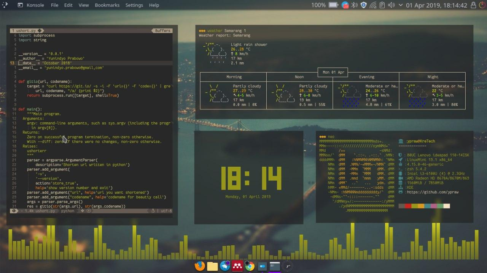
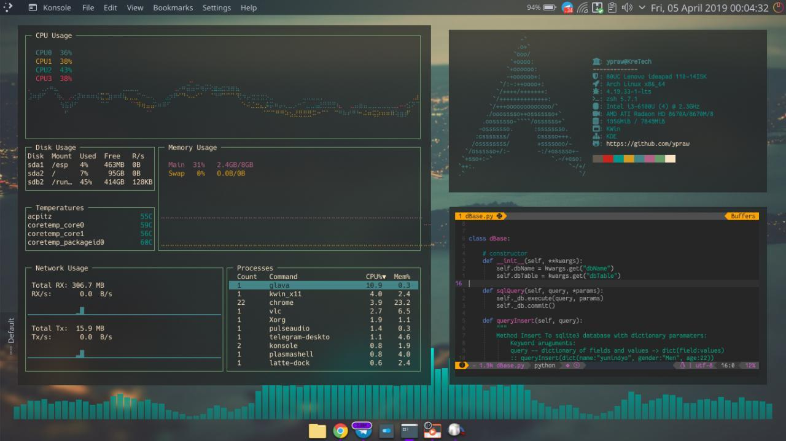

Hai jumpa lagi pada artikel yang bertemakan [Linux](/category/linux), pada kesempatan kali ini, saya akan menuliskan beberapa tips untuk memulai kustomisasi desktop linux. Sebelumnya kita telah mempelajari bagaimana cara mempercantik terminal linux menggunakan zsh dengan bantuan plugin zplug, untuk yang belum membaca artikel tersebut, dapat dibaca pada tautan [berikut](/kustomisasi-terminal-linux).

Pada artikel ini, saya akan menjelaskan trik-trik dasar mengenai ricing. Sebelum itu kita bahas dulu apa itu ricing.

## Apa itu Ricing?
Ada beberapa pendapat mengenai awal mula kata ricing, yang paling terkenal adalah bermula dari kata _**Race Inspired Cosmetic Enhancement**_, lomba mempercantik mobil dengan menambahkan banyak aksesoris tanpa peduli dengan mesin yang pada akhirnya tidak akan membuat perbedaan berarti kecuali hanya dari tampilan.
Pada akhirnya, _**Making improvements to a system that don't actually do anyone any good, and can sometimes have negative ramifications**_ xixixi.

Inti dari ricing adalah merubah tampilan sedemikian mungkin untuk mencari kenyaman dalam menggunakan linux sebagai perangkat kerja sehari-hari.

## Kebutuhan
Para _Ricer_ seperti di komunitas LDA(_Linux Desktop Art_) ataupun _Community Forum_ seperti _Unixporn_ sering berbagi hasil ricing mereka melalui gambar-gambar ataupun video disertai dotfilenya. Umumnya mereka menggunakan wm (_window manager_) sebagai media utama mereka dalam melakukan kegiatan ini. Beberapa wm terkenal seperti openbox, i3-wm, dwm, fluxbox dsb sering sekali tampil dalam forum-forum tersebut. Lantas, bagaimana dengan para pengguna desktop environtment seperti gnome, xfce ataupun plasma ?? tentu juga ada dari mereka yang melakukan kegiatan ricing pada desktop environtmen, hanya saja biasanya kebutuhan-kebutuhan khusus seperti bar atau panel bar sudah disediakan oleh desktop environtment terkait sehingga jangkauan untuk kustomisasinya lebih sedikit. Kita ambil contoh para pengguna wm biasanya akan mengkustomisasi bar seperti polybar ataupun lemon bar dengan launcher seperti rofi misalnya. Hal ini bisa saja dilakukan pada desktop environtment hanya saja sedikit lebih kecil ruang lingkupnya. Pada desktop environtment KDE PLasma misalnya yang telah menyediakan runner (krunner) ataupun panel default maupun Application Menu Bar.

Pada artikel ini kita hanya akan bermain pada aplikasi-aplikasi yang sering digunakan untuk mempercantik tampilan yang dapat diinstall di semua jenis wm ataupun desktop environtment, karena hampir semua aplikasi ini berbasiskan terminal.

### Alat Tempur
sebagai contoh seperti gambar dibawah ini,



pada gambar diatas, saya menggunakan linux mint dan desktop environtment kde plasma. Seperti yang saya bilang diawal bahwa ini merupakan artikel sederhana untuk memulai mengkustomisasi tampilan dengan cara yang paling sederhana yaitu menggunakan beberapa tools berbasiskan terminal.

tools-tools yang berjalan pada gambar diatas adalah

* tty-clock
    Aplikasi ini merupakan aplikasi untuk menunjukkan jam pada terminal anda, untuk menginstall aplikasi ini dapat dilakukan dengan beberapa cara tergantung distribusi anda.
    #### Ubuntu
    ```bash
    sudo apt install tty-clock
    ```
    #### Arch
    ```bash
    trizen -S tty-clock
    ```
    atau anda dapat membuildnya sendiri dari repo githubnya [tty-clock](https://github.com/xorg62/tty-clock)

    untuk menyerupai tampilan diatas dapat menjalankan perintah sebagai berikut

    ```bash
    tty-clock -c -C 4 -s -f "%A, %d %B %Y"
    ```
    untuk lebih lengkapnya anda dapat membaca panduannya dengan mengetikkan
    ```bash
    man tty-clock
    ```
    dan untuk format tanggalnya anda bisa membaca tautan [berikut](https://www.cyberciti.biz/faq/linux-unix-formatting-dates-for-display/)

* Neofetch
    Merupakan aplikasi command-line untuk menampilkan system info, anda dapat mendowloadnya baik dari repository atupun dari github resminya tergantung distribusi yang anda gunakan dan pastikan bahwa anda telah menginstall font yang telah mensupport fontawesome seperti powerline-font ataupun nerd-fonts.

    sebagai contoh anda dapat menggunakan font berikut [Fantasque nerd font](https://github.com/ypraw/configDotfiles/tree/master/fonts)

    #### ubuntu/derivative
    ```bash
    sudo apt install neofetch
    ```

    #### Arch/derivative
    ```bash
    sudo pacman -S neofetch
    ```
    untuk keterangan lebih lanjut anda dapat membaca wiki yang disediakan oleh pengembang neofetch [disini](https://github.com/dylanaraps/neofetch/wiki).

    disini saya hanya memberikan contoh config yang anda dapat tiru dan anda sesuaikan berdasarkan selera anda. [config](https://github.com/ypraw/configDotfiles/blob/master/neofetch/config.conf)

    cara menggunakannya, buatlah file baru yang anda namakan misalnya ```config.conf``` pada directory ```~/Neofetch/``` kemudian salin semua code yang ada pada tautan yang saya berikan kedalam config.conf anda.

    kemudian panggil dengan perintah berikut,
    
    ```bash
    neofetch --config ~/Neofetch/config.conf
    ```
    sesuaikan dengan directory anda menyimpan file tersebut. 
    
    tips untuk mempermudah, gunakan fitur alias [dapat dibaca disini](https://www.tecmint.com/create-alias-in-linux/).

* wttr.in
    Merupakan web penyedia informasi cuaca di beberapa Negara termasuk Indonesia, dan dapat digunakan secara langsung pada terminal dengan memanfaatkan fitur ```curl```

    untuk lebih lengkapnya gunakan syntax berikut ini.
    ```bash
    curl wttr.in/Semarang\?1
    ```
    dalam syntax diatas, kita akan mengambil informasi cuaca pada kota Semarang dengan interval waktu satu hari penuh, sesuaikan dengan kota anda dan interval waktunya.
    seperti sebelumnya, anda dapat mengggunakan fitur alias dan sedikit bermain-main dengan pemrograman bash.
    
    ```bash
    weather(){
    curl wttr.in/$1\?$2
    }
    ```
    simpan pada file ```.aliases``` atau file ```.zshrc``` anda.
    fungsi ini dapat dijalankan dengan
    ```bash
    # weather Kota jumlahHari
    weather semarang 1
    ```
* GLAVA aplikasi audio visualizer, untuk penginstalannya anda dapat membaca di tautan berikut [Glava](https://github.com/wacossusca34/glava)

* VIM text editor paling legend dimuka bumi ini, saya menggunakan spacevim yang anda bisa lihat di tautan berikut [Spacevim](https://github.com/SpaceVim/SpaceVim)

## Contoh Lain 



Sama seperti contoh diatas, hanya disini saya menambahkan 1 aplikasi activity yaitu gotop.

untuk instalasinya anda dapat mengikuti panduan dari halaman github resminya [gotop](https://github.com/cjbassi/gotop)


## TIPS

Beberapa tips yang anda dapat lakukan selain menggunakan aplikasi-aplikasi diatas adalah pemilihan warna.

Pemilihan warna disini yaitu lebih kepada penggunaan warna pada color scheme terminal anda yang disesuaikan dengan basis warna wallpaper yang anda gunakan. Trik sederhana ini akan memberikan kesan magic dan tentu saturasi warna yang lebih enak dilihat.

selain anda dapat mengkonfigurasi secara manual pada terminal anda, anda juga dapat menggunakan satu tools paling ajaib, yaitu [pywal](https://github.com/dylanaraps/pywal).

# PENUTUP

Dunia linux merupakan dunia yang paling flexible dalam hal apapun terkait konfigurasi baik teknis seperti setup server, coding bahkan hal-hal terkait tampilan. Sebagai langkah awal dimulai dengan terminal dan beberapa aplikasi pendukung seperti yang sudah saya jelaskan diatas. Tentu masih banyak hal-hal yang dapat dilakukan bahkan ditingkat yang lebih extreme (baca: advance) seperti mengganti panel dengan panel yang lebih customisable seperti polybar ataupun lemonbar atau juga mengganti window manager yang berbasiskan keyboar dan binding shortcut seperti i3 dsb. Tutorial ini hanya langkah kecil dari memulai hal sederhana yaitu ricing tampilan linux. Dan seperti yang saya juga bilang diawal, bahwa Ricing bisa menjadi sesuatu yg sangat useless dan belum tentu berguna bagi semua orang, tapi kembali lagi bahwa _**Aesthetic itu adalah seni, dan seni bisa menjadi kedamaian bagi sebagian orang dan pencapaian kepuasan batin yang hanya bisa dirasakan dengan hati XD**_.

### Inspirasi dan Sumber Bacaan

[config dotfiles pribadi](https://git.io/yprawdotfiles)

[Pakde Epsi](https://epsi-rns.github.io/pages/index)

[Bandithijo](https://bandithijo.com)
 
[Reddit/r/Unixporn](https://www.reddit.com/r/unixporn)(gunakan vpn)

[Another Inspired theme,dotfile,tips and tricsk from Adhi Pambudi](https://github.com/addy-dclxvi)