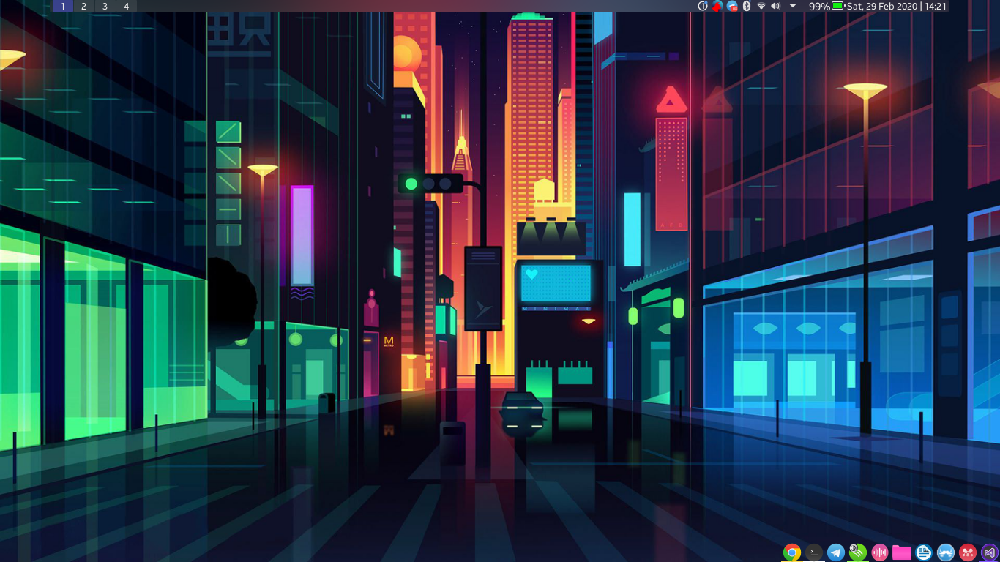
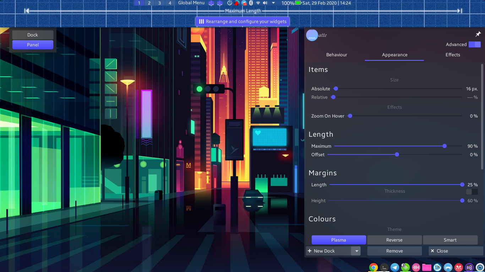

[[description]]
Hallo para pembaca, setelah sekian lama hiatus, akhirnya saya bisa menulis blog kembali. Setelah banyak berbincang dibeberapa grup linux, banyak yang menanyakan kepada saya desktop environtment apa yang saya gunakan, oke seperti di post [sebelumnya](/mengenal-linux-desktop-art) sudah saya singgung beberapa paket yang saya gunakan untuk menghias desktop yang saya gunakan, kali ini lebih terfokus kepada apa saja yang saya rubah dari desktop environtment yang saya gunakan yaitu kde plasma.

### Latte Dock

Sudah bukan rahasia lagi, mejik dari kustomisasi di plasma adalah latte dock. Latte dock ini merupaka docking sistem yang dikembangkan khusus untuk plasma, untuk lebih detilnya bisa diakses disini [Github official Latte Dock](https://github.com/KDE/latte-dock). Langkah pertama tentu dengan menginstallnya, ikuti petunjuk dari dokumentasi official yang telah disediakan oleh developer. Untuk pengguna arch linux dan derivative nya dapat penggunakan perintah berikut

```shell
sudo pacman -S latte-dock
```

sedangkan untuk pengguna ubuntu dan derivative nya dapat menggunakan perintah berikut,

```shell
 sudo apt install latte-dock
```

lalu apa yang saya kustomisasi dari latte ini???

saya menggunakan 2 panel latte seperti dibawah ini,



bagian atas dan bagian bawah.

- Bagian Atas
  untuk bagian atas, saya menggunakan mode panel, dengan konfigurasi sebagai berikut

  

  didalamnya, saya menambahkan pager sebagai penanda desktop, kemudian ada global menu, system tray, inline battery, chili clock. Semua widget ini sebagian merupakan widget default bawaan plasma, sisanya dapat diinstall dari menu add widget

- Bagian Bawah

  Pada bagian ini tidak ada yang spesial, karena secara default merupakan bawaan latte itu sendiri, disini saya hanya menyesuaikan beberapa shortcut icon untuk keperluan pribadi.

### Theme

Pada dasarnya bagian ini tidak banyak yang saya rubah, saya menggunakan tema dari plasma store yaitu [layan](https://store.kde.org/p/1325241/) atau anda dapat menginstall secara langsung dari kode sumber [Layan Github Official](https://github.com/vinceliuice/Layan-kde).

Khusus untuk pengguna arch derivative, dapat mengistall langsung dari aur.

```shell
trizen -S layan-kde-git
```

atur semua tema dan warna, dan terakhir jangan lupa atur kvantum theme anda menjadi layan.

Demikian sedikit tutorial mengenai apa yang saya gunakan untuk mempercantik dekstop environtment saya.

see you in next article guys XD
