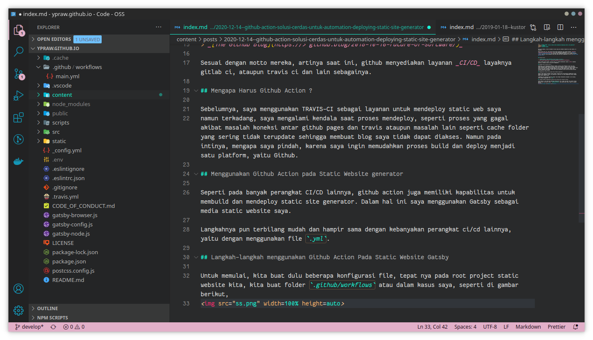

Halo para pembaca, lama tak membuat tulisan yang bisa membuat komputer/pc anda njebluk, eh wkwkwkkw.

Pada tulisan kali ini, saya ingin menceritakan pengalaman saya pindah perkakas _continous integration and Continous Delivery_ dari yang sebelumnya menggunakan [Travis-CI](https://travis-ci.com/getting_started) dan sekarang saya menggunakan github action sebagai perkakas _CI/CD_ yang baru untuk mendeploy blog saya yang saya buat menggunakan [Gatsby JS](https://www.gatsbyjs.com/).


## Github Action

> _`Github Action Is Your Workflow: built by you, run by us`_
> _[The Github Blog](https://> github.blog/2018-10-16-future-of-software/)_

Sesuai dengan motto mereka, artinya saat ini, github menyediakan layanan _CI/CD_ layaknya gitlab ci, ataupun travis ci dan lain sebagainya.

## Mengapa Harus Github Action ?

Sebelumnya, saya menggunakan TRAVIS-CI sebagai layanan untuk mendeploy static web saya
namun terkadang, saya mengalami kendala saat proses mendeploy, seperti proses yang gagal akibat masalah koneksi antar github pages dan travis ataupun masalah lain seperti cache folder yang sering tidak terupdate sehingga membuat blog saya tidak dapat diakses. Namun pada intinya, mengapa saya pindah, karena saya ingin memudahkan proses build dan deploy menjadi satu platform, yaitu Github.

## Menggunakan Github Action pada Static Website generator

Seperti pada banyak perangkat CI/CD lainnya, github action juga memiliki kapabilitas untuk membuild dan mendeploy static site generator. Dalam hal ini saya menggunakan Gatsby sebagai media static website saya.

Langkahnya pun terbilang mudah dan hampir sama dengan kebanyakan perangkat ci/cd lainnya, yaitu dengan menggunakan file `.yml`.

## Langkah-langkah menggunakan Github Action Pada Static Website Gatsby

### Membuat folder konfigurasi {`.github/workflows`}

Untuk memulai, kita buat dulu beberapa konfigurasi file, tepat nya pada root project static website kita, kita buat folder `.github/workflows` atau dalam kasus saya, seperti di gambar berikut,



dilanjutkan dengan membuat file konfigurasi `.yml` atau saya menggunakan file `main.yml`.


### Membuat file konfigurasi {`main.yml`}

kemudian isikan file dengan perintah berikut
```yml
name: github pages

on:
  push:
    branches:
      - develop

jobs:
  deploy:
    runs-on: ubuntu-18.04
    steps:
      - uses: actions/checkout@v2

      - name: Setup Node
        uses: actions/setup-node@v2.1.2
        with:
          node-version: '10.x'

      - name: Cache dependencies
        uses: actions/cache@v2
        with:
          path: ~/.npm
          key: ${{ runner.os }}-node-${{ hashFiles('**/package-lock.json') }}
          restore-keys: |
            ${{ runner.os }}-node-

      - name: INSTALL DEPENDENCIES
        run: npm ci

      - name: BUILING SITE
        run: npm run build
        env:
          ALGOLIA_APP_ID: ${{secrets.ALGOLIA_APP_ID}}
          ALGOLIA_SEARCH_ONLY_API_KEY: ${{secrets.ALGOLIA_SEARCH_ONLY_API_KEY}}
          ALGOLIA_ADMIN_API_KEY: ${{secrets.ALGOLIA_ADMIN_API_KEY}}
          ALGOLIA_INDEX_NAME: ${{secrets.ALGOLIA_INDEX_NAME}}
          FB_APP_ID: ${{secrets.FB_APP_ID}}

      - name: Deploy
        uses: peaceiris/actions-gh-pages@v3
        with:
          github_token: ${{ secrets.ACCESS_TOKEN }}
          deploy_key: ${{ secrets.SECRET_KEY_DEPLOY_SITE }}
          publish_dir: ./public
          publish_branch: master
          enable_jekyll: true
          force_orphan: true
          full_commit_message: ${{ github.event.head_commit.message }}
          user_name: 'github-actions[bot]'
          user_email: 'github-actions[bot]@users.noreply.github.com'
```

secara sederhana, langkah diatas dapat dijabarkan sebagai berikut:
* Checkout repository
* setup node versi 10
* install dependency via npm
* build the sites
* deploy the result

untuk penjelasan lebih lanjut mengenai github action dan cara mendeploynya, tunggu artikel selanjutnya yaaaa XD.