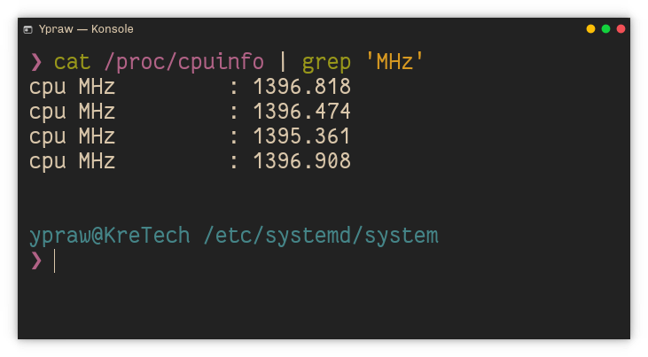

Terkadang kita membutuhkan performa perangkat yang maksimal saat menggunakan beberapa software tertentu ataupun pada saat kita melakukan
kompilasi pada kernel ataupun pada program yang sedang kita buat (untuk para developer khususnya). Atau bahkan membuat perangkat yang menggunakan
battery sepertihalnya laptop untuk selalu irit maksimal (maklum, produk yang kita gunakan beda dari produk buah bekas gigitan) xixixi.

Nah ada satu solusi yang cukup menjanjikan walaupun butuh sedikit usaha untuk melakukan beberapa konfigurasi yang dibutuhkan. Yaitu dengan
teknik **_cpu scalling_** yaitu sebuah cara untuk mengizinkan sistem operasi untuk melakukan penskalaan cpu frekuensi.

Pada konfigurasi default sebuah kernel linux (3.4 keatas), frekuensi cpu sudah diatur sedemikian rupa agar menunjang segala macam aktifitas user dan dioptimalisasi agar sesuai dengan load aktifitasnya sehingga memberikan performa maksimal dan konsumsi daya seirit mungkin. Namun ini masih dapat dirubah ataupun di konfigurasi lebih lanjut menggunakan _userspace tools_ seperti _cpupower,acpid_ dan sebagainya.

### Peringatan

> * tutorial ini dilakukan menggunakan OS manjaro namun seharusnya dapat dilakukan pada os lain seperti ubuntu dan sebagainya
> * tutorial ini dilakukan dengan menggunakan cpu intel, untuk cpu amd mungkin terdapat perbedaan pada driver cpu yang digunakan
> * sebagian besar perintah terminal pada tutorial ini menggunakan hak akses sudo.

## Inisiasi kebutuhan perangkat lunak

Pastikan bahwa tools **_cpupower_** sudah terinstall, jika belum install tools tersebut dengan perintah dibawah

* Manjaro atau turunan arch linux lainnya

  ```bash
    sudo pacman -S cpuopower```

* Ubuntu/debian atau turunan lainnya

    ```bash
    sudo apt install  linux-tools-common linux-tools-generic linux-tools-'uname -r'```

## Merubah driver cpu bawaan

Seperti yang disebutkan diatas, pada dasarnya kernel linux (3.4 atau terbaru) sudah mengatur sedemikian rupa power management pada konfigurasi bawaan. Jika masih kurang dengan performa bawaan, bisa di mulai dari tutorial yang sebelumnya syaa tulis [Power Management Linux](/Linux-First-Install/). Atau lanjut dengan scalling cpu.

langkah pertama, yaitu kita mengecek driver mana yang terload saat ini dengan menggunakan perintah :

```bash
sudo cpupower frequency-info | grep driver
```

Hasilnya mungkin seperti dibawah ini:

```bash
driver: intel_pstate
```

Hasil diatas mengindikasikan bahwa kita sedang menggunakan driver ```intel_pstate``` yang mana secara default sudah dikonfigurasi oleh sistem. Driver ini membawa dua konfigurasi umum, yaitu ```performacnce``` atau ```powersave```. Namun bagaimanapun, konfigurasi ini tidak seflexible untuk melakukan scalling frequency cpu. Untuk itu kita akan mendifinisikan driver baru yaitu ```acpi_cpufreq```.

untuk menggantinya, kita akan menonaktifkan terlebih dahulu ```intel_pstate``` dengan menambahkan parameter pada grub param, yang dapat diakses di lokasi ```/etc/default/grub``` dan kita tambahkan parameter ```intel_pstate=disable``` di baris ```GRUB_CMDLINE_LINUX_DEFAULT``` menjadi seperti ini,

```bash
GRUB_CMDLINE_LINUX_DEFAULT="quite intel_pstate=disable"
```

kemudian kita ```update-grub``` lalu restart perangkat.

## Tweaking

Kita dapat mengkonfirmasi perubahan driver setelah restart dengan perintah berikut:

```bash
sudo cpupower frequency-info | grep driver
```

kemudian kita meload module ```cpufreq_userspace`` dengan perintah berikut,

```bash
modprobe cpufreq_userspace
```

lalu kita load userspace governor untuk melakukan scalling dengan perintah berikut,

```bash
sudo cpupower frequency-set -g userspace
```

dilanjutkkan dengan menset frequency cpu dengan contoh berikut,

```bash
sudo cpupower frequency-set -f 1400MHz
```

kira-kira kita akan mendapatkan hasil seperti berikut,



untuk memudahkkan kita menscale pada saat perangkat pertama kali dihidupkan, selanjutnya kita akan membutuhkan module ```cpufreq_userspace``` agar terload secara otomatis, dan  kita akan membuat service baru dengan systemd agar setiap reboot kita menjalankan frequency sesuai dengan yang kita definisikan.

pertama kita akan membuat file untuk meload module ```cpufreq_userspace``` pada diretory ```/etc/modules-load.d/modules.conf```
isikan sebagai berikut :

```bash
# List of modules to load at boot
cpufreq_userspace
```

lalu kita akan membuat service systemd untuk mengatur frequency saat pertamaa perangkat booting, beruhubung disini saya menggunakan laptop tentu saat pertama kali saya menset dengan frequency yang rendah. Untuk lokasi directory file servicenya dapat ditemukan di ```/etc/systemd/system/```
dan kita akan membuat file baru bernama ```cpupower.service``` dengan isi sebagai berikut,

```bash
[Unit]
Description=CPU Powersave on Start

[Service]
Type=oneshot
ExecStart=/usr/bin/cpupower frequency-set -f 1200MHz

[Install]
WantedBy=multi-user.target

```

kemudian kita mengaktifkan service tersebut dengan perintah :

```bash
sudo systemctl enable cpupower.service
```

lalu restart perangkat anda dan _voila_.

## CATATAN PENTING

Disini saya mendefinisikan 1200MHz atau setara dengan 1.2 GHz sebagai inisialisasi clock speed awal agar konsumsi daya perangkat saya sedikit lebih irit. Anda bisa menset dengan speed sesuai dengan keinginan anda.

> * sebagai catatan untuk clock speed mulailah dari 30-50% dari total clock speed maximal dari cpu anda
> * atau dengan base clock dari processor anda, [cari disini](https://ark.intel.com/content/www/us/en/ark.html)
> * dalam kasus saya, yaitu i7-4600u dengan maksimal clock speed 3.3GHz atau 3300MHz
> * saya menggunakan 36% clock speed untuk inisisasi awal atau berkisar 1200MHz atau 1.2GHz

### Referensi

> * [CPU frequency scaling](https://wiki.archlinux.org/index.php/CPU_frequency_scaling)
> * [Power Management Arch Wiki](https://wiki.archlinux.org/index.php/Power_management)
