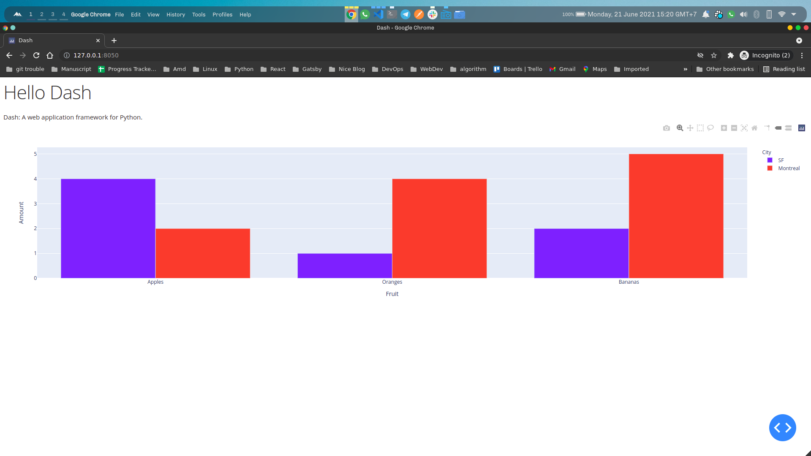

Sudah lama saya tidak menulis catatan kecil untuk keberlangsungan hidup para programmer lain, eh wkwkwkwk.

Pada tulisan kali ini saya akan mengenalkan sebuah tools yang sangat berguna bagi para data engineer maupun data scienctist atau bahkan data analyst yang dituntut untuk membuat visualisasi data menggunakan teknologi web.

### Data Analyst vs Data Engineer vs Data Scientist
Sedikit penjelasan mengenai data engineer, data scienctist dan data analyst.
Data engineer, adalah profesi yang dituntut untuk mengembangkan dan membuat design untuk managemen data dan memonitoring infrastrukturnya, fokus dalam bidang ini umumnya yaitu _ETL (Extract, Transform, Load)_.
Disisi lain, seorang data analis akan berkewajiban untuk membersihkan, menganalisa dan membuat visualisasi data yang telah di kumpulkan oleh data enginner. Sedangkan data scientist hampir sama tugasnya dengan data analyst namun dengan pendekatan yang berbeda yaitu dengan memprediksi data yang telah bersih menggunakan algoritme pembelajaran mesin ( _machine learning_ ) kemudian memprediksi hasilnya dan memberikan insight kepada perusahaan bagaimana prediksi untuk kedepannya.

Singkat kata, seorang superman data dituntut untuk bisa ketiganya, eh maksudnya tim data akan selalu terdiri dari 3 bidang-bidang tersebut.

### Preambule Dash

Seperti yang disebutkan diatas, tak pelak data akan menjadi sangat penting untuk di ekstrak infromasinya melaui cara-cara tertentu kemudian dipresentasikan, disajikan serta ditarik sebuah kesimpulan. Salah satu proses yang penting dalam menarik sebuah kesimpulan dari kumpulan data yaitu dengan memvisualisasinya kedalam bentuk diagram, tabel dan lain sebagainya. Untuk itu kita diharapkan setidaknya mengenal beberapa tools dalam proses visualisasi ini, yang paling umum seperti [jupyter-notebook](https://jupyter.org/), [matplotlib](https://matplotlib.org/), [seaborn](https://seaborn.pydata.org/) dan yang akan dibahas pada artikel ini yaitu [dash plotly](https://plotly.com/dash/). Sebuah platform web untuk membangun visualisasi data menggunakan flask, plotly.js dan react js.

### Dash Plotly
Yaps, anda tidak salah membaca, ```Sebuah platform web untuk membangun visualisasi data menggunakan flask, plotly.js dan react js```.
Dash plotly menggunakan flask sebagai backend serta react js dan plotly.js sebagai frontend untuk membagun data visualization dalam bentuk web yang tidak terbatas hanya pada plot-plot chart namun juga dengan proses berat lain yang mungkin saja dibutuhkan misalnya proses pelatihan model pembelajaran mesin dan sebagainya.

Seorang data analyst, maupun data scientist mungkin saja dan bahkan hampir dipastikan tidak mendalami bidang web programming apalagi bidang ui ataupun desain. Maka, untuk membuat sebuah web, tentu saja akan mengalami kendala yang mungkin saja bisa menambah beban kerja dan beban waktu untuk melakukan riset, sehingga mungkin akan membutuhkan tim lain untuk mendevelop atau membangun sebuah website untuk monitoring data misalnya. Nah solusi sederhana bagaimana seorang data analyst maupun data scientist dapat membuat website sebagai sarana visualisasi data menggantikan jupyter notebook misalnya, yaitu dengan menggunakan dash.

### Instalasi Dash
Untuk memulai dan sebagai rekomendasi yang diambil dari beberapa sumber, kita akan menyiapkan sebuah virtual environtment untuk memulai menggunakan dash.
Pertama-tama kita siapkan dahulu virtual-environmentnya menggunakan perintah berikut dan pastikan juga perangkat anda telah terinstall python.


```bash
python -m venv ./myvenv
```
setelah perintah ini dijalankan, maka akan terbentuk folder yang bernama `myvenv` , kemudian dilanjutkan dengan mengaktifkan venv tersebut dengan perintah berikut:

```bash
source ./myvenv/bin/activate
```

kemudian, kita install packagenya menggunakan command pip,

```bash
pip install dash
```

sedikit tambahan kita install sekalian beberapa package pendukung seperti pandas, dan numpy dengan perintah :

```bash
pip install pandas numpy
```

### Dash Layout
Bagian Layout merupakan bagian dimana aplikasi kita akan di render pada frontend, dengan kata lain merupakan bagian template view bagaimana aplikasi kita terlihat.
Pada bagian ini, kita akan membuat satu file dengan nama `app.py` kemudian kita isikan dengan beberapa syntax berikut,

```python
# -*- coding: utf-8 -*-

# Run this app with `python app.py` and
# visit http://127.0.0.1:8050/ in your web browser.

import dash
import dash_core_components as dcc
import dash_html_components as html
import plotly.express as px
import pandas as pd

external_stylesheets = ['https://codepen.io/chriddyp/pen/bWLwgP.css']

app = dash.Dash(__name__, external_stylesheets=external_stylesheets)

# assume you have a "long-form" data frame
# see https://plotly.com/python/px-arguments/ for more options
df = pd.DataFrame({
    "Fruit": ["Apples", "Oranges", "Bananas", "Apples", "Oranges", "Bananas"],
    "Amount": [4, 1, 2, 2, 4, 5],
    "City": ["SF", "SF", "SF", "Montreal", "Montreal", "Montreal"]
})

fig = px.bar(df, x="Fruit", y="Amount", color="City", barmode="group")

app.layout = html.Div(children=[
    html.H1(children='Hello Dash'),

    html.Div(children='''
        Dash: A web application framework for Python.
    '''),

    dcc.Graph(
        id='example-graph',
        figure=fig
    )
])

if __name__ == '__main__':
    app.run_server(debug=True)
```

kemudian kita jalankan dengan perintah sebagai berikut :

```bash
python app.py
```

dilanjutkan dengan membuka browser kita pada alamat berikut `127.0.0.1:8050`.

maka akan tampil layout sebagai berikut.
<!--  -->
<re-img src="dash.png" width=100% height=auto></re-img>
<!--  -->